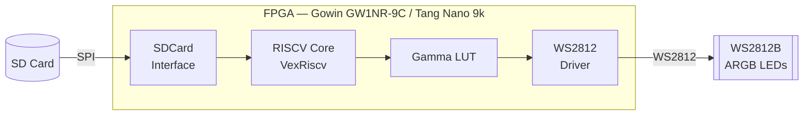

# Tang Nano 9K LED Animator

A small LiteX RISC-V SoC for the Sipeed Tang Nano 9K (Gowin GW1NR-9C) that
reads a `.fled` animation file from an SD card and plays it out to a
WS2812B ("NeoPixel") LED strip via an autonomous hardware DMA engine — the
CPU loads the file once and configures the hardware; playback then runs
entirely on its own.

Split out from a larger Tang Nano 20K accelerator project as its own
self-contained repo (`tang_nano_9k_led_animator`). Verified in cocotb
simulation and confirmed running on real Tang Nano 9K hardware (SD card
mount + read, header parse, DMA autonomously pacing frames) — the physical
WS2812 pin itself has **not** been visually verified yet, since no LED
strip was attached during bring-up. Two more recent additions, gamma
correction and a PSRAM frame buffer, are synthesis-verified but likewise
not yet confirmed on real hardware. See [Status / caveats](#status--caveats)
below.

Two features added on top of the original design, both made possible by
the LUT headroom the synthesis table below shows:
- **Gamma correction** (`rtl/gamma_lut.v`) — a 256-entry gamma=2.8 lookup
  table applied to each R/G/B byte before it reaches the WS2812 driver, on
  by default (`LedAnimator.gamma_enable` CSR), so colors look right to the
  eye instead of washed-out/linear.
- **PSRAM frame buffer** (`hardware/soc_tang_nano_9k_led_anim.py`'s
  `add_psram()`) — the `.fled` payload can now be loaded into a 4MB
  external PSRAM region instead of the 2KB on-chip SRAM buffer, so much
  longer/larger animations fit. **Experimental** — see caveats below.

## Hardware



- Sipeed Tang Nano 9K (Gowin GW1NR-LV9QN88PC6/I5)
- A FAT/FAT32-formatted micro-SD card in the board's SPI-mode slot
- A WS2812B strip, data line on **J7 pin 49**, with a common ground to the
  board. WS2812B nominally wants ~5V logic levels; the Tang Nano's GPIO is
  3.3V. Many strips work fine driven directly at 3.3V (especially short
  runs on a fresh strip), but a 3.3V→5V level shifter on the data line is
  the more reliable option if you see flicker or the first LED misbehaving.

## Two SoC targets

| Target | Script | What it does |
|---|---|---|
| `sdcard` | `hardware/soc_tang_nano_9k_sdcard.py` | Mounts the SD card and lists its root directory over UART (feasibility test) |
| `led_anim` | `hardware/soc_tang_nano_9k_led_anim.py` | (default) Reads `ANIM.FLED` from the SD card and plays it on the LED strip |

Both use a RISC-V **VexRiscv "minimal"** core (RV32I, no MMU/mul/div) —
**not Ibex**: Ibex was tried first and does not fit this device (real Gowin
synthesis needs 18571 DFFs against the GW1NR-9C's 6693 DFF budget).

Both also skip the interactive LiteX BIOS entirely. This device's usable
on-chip block RAM is small — early attempts at a full BIOS (~27KB, ROM
auto-sized) plus a separate main_ram blew LUT usage far past budget (the
excess silently falls back to LUT-based distributed RAM, ~1 LUT per few
bits). The fix: our firmware is linked BIOS-style (`.text`/`.rodata`
execute directly from ROM, see `firmware_*/linker.ld`) and passed to LiteX
as `integrated_rom_init`, so it *is* the ROM content — no BIOS, no
serialboot, no separate main_ram, and no persistent SPI-flash write. Every
build/program cycle is pure SRAM-only JTAG configuration, fully reversible
by re-programming. (The PSRAM frame buffer added since, below, is a
separate opt-in bus region for animation *data* only — it does not change
any of this boot-time story, and needs no software calibration step
either: LiteX's `HyperRAM` core self-times the protocol from RTL.)

Real synthesis results (`led_anim`, Gowin V1.9.11.03, before the PSRAM/
gamma additions below):

| Resource | Used | Budget | % |
|---|---|---|---|
| Logic (LUT+ALU+ROM16+SSRAM) | 3799 | 8640 | 47% |
| Registers | 2178 | 6693 | 33% |
| BSRAM blocks | 14 | 26 | 54% |

With PSRAM + gamma correction added, resynthesized with the open-source
`apicula` toolchain (`yosys` + `nextpnr-himbaechel`, `--toolchain apicula`
— a *different* synthesis flow than the Gowin table above, so the two
aren't directly comparable cell-for-cell, but both confirm the design fits
comfortably with room to spare):

| Resource | `--no-psram` (gamma only) | with PSRAM |
|---|---|---|
| LUT4 | 4159 / 8640 (48%) | 4827 / 8640 (55%) |
| DFF  | 2268 / 6480 (35%) | 2597 / 6480 (40%) |
| BSRAM | 7 / 26 (26%) | 7 / 26 (26%) |
| Max `sys_clk` (PASS at 27MHz) | 43.7MHz | 40.4MHz |

So the HyperRAM core itself costs ~670 LUT4 (~7% of the device) — the
PSRAM frame buffer was exactly the kind of thing the spare LUT budget was
for.

## `.fled` file format

```
Offset 0x00-0x03  Magic "FLED" (compare the raw bytes, not an int -- avoids
                  endianness ambiguity)
Offset 0x04       Version (0x01)
Offset 0x05       Target frame rate (FPS)
Offset 0x06-0x07  LED count (uint16, little-endian)
Offset 0x08-0x0B  Total frame count (uint32, little-endian)
Offset 0x0C-0x0F  Flags / reserved (0x00000000)
Offset 0x10+      Raw RGB bytes, frame-major:
                  frame_count * led_count * 3 bytes total
```

WS2812B wants GRB bit order on the wire; `rtl/ws2812_driver.v` reorders
RGB → GRB internally, so the file and firmware only ever deal in RGB.

With the default `with_psram=True` SoC build, the payload buffer is 4MB of
external PSRAM (`FLED_MAX_PAYLOAD` becomes `PSRAM_SIZE` in
`firmware_led_anim/main.c`) instead of on-chip SRAM — `LedAnimator.base_addr`
just needed a Wishbone-bus-visible byte address, so no RTL changes were
required, only a new bus region (see `add_psram()` in
`hardware/soc_tang_nano_9k_led_anim.py`). Build with `--no-psram` to fall
back to the original 2KB on-chip SRAM buffer (comfortably covering short
test clips — the sample `ANIM.FLED` used during bring-up was 64 LEDs × 2
frames = 384 bytes) instead.

## Architecture

- `rtl/ws2812_driver.v` — bit-bangs the WS2812B one-wire protocol from a
  simple pixel valid/ready stream, timed in sys_clk cycles (parameterized
  by `SYS_CLK_FREQ_HZ`), appends the reset/latch pulse automatically.
- `rtl/gamma_lut.v` + `rtl/gamma_lut.mem` — a single-cycle combinational
  256-entry gamma=2.8 lookup table (`out = round(255*(in/255)^2.8)`,
  matching common WS2812 defaults e.g. FastLED), loaded via `$readmemh`
  from the `.mem` file (regenerate it for a different gamma). The
  `GAMMA_LUT_FILE` parameter is threaded through `led_animator_controller.v`
  and set to an absolute path by both callers (`led_animator_module.py` for
  hardware, `sim/run_sim.py` for simulation) — `$readmemh` resolves its
  path relative to the toolchain's cwd at elaboration/runtime, which
  differs across the Verilator/Gowin/apicula flows this project uses, so a
  bare relative filename isn't reliable here. Shared by all three R/G/B
  bytes since the byte-stream reader only ever handles one byte per cycle.
- `rtl/led_animator_controller.v` — a Wishbone bus-master DMA engine: reads
  the animation byte-by-byte from memory (handles a non-word-aligned start
  address), paces frames to a configured interval (start-to-start timing,
  so the frame rate is constant regardless of how fast a frame actually
  transmits), loops or stops at the end, fires a `frame_done` IRQ,
  optionally gamma-corrects each byte via `gamma_lut`. Wraps
  `ws2812_driver` internally.
- `hardware/led_animator_module.py` — Migen/LiteX CSR wrapper
  (`base_addr`, `led_count`, `frame_count`, `frame_interval`, `enable`,
  `loop`, `gamma_enable`, `busy`, `current_frame`, plus a `frame_done`
  interrupt). `enable` is a **write-strobe**, not a level, for starting
  playback (a plain CSR write of 1 (re)starts from frame 0); *stopping*
  mid-loop is still a level check on the same bit — this avoids a
  non-looping animation self-restarting forever if firmware leaves
  `enable=1` set after it naturally finishes.
- `hardware/soc_tang_nano_9k_led_anim.py` — wires it all into the SoC as a
  Wishbone bus master + CSR slave, with the physical WS2812 pin on J7/49,
  plus (`add_psram()`, default on) a 4MB PSRAM bus region for the frame
  buffer.
- `firmware_led_anim/main.c` — mounts the SD card, opens `ANIM.FLED`,
  validates the header, loads the RGB payload into RAM (PSRAM if built
  with it, on-chip SRAM otherwise), configures the DMA core's CSRs, writes
  `enable=1`, then just prints `busy`/`current_frame` periodically to
  prove the hardware is alive.

## Building & running

Needs: a Python venv with `litex`, `litex-boards`, and `migen` installed
(pass its path via `LITEX_PYTHON`, or have it active as `$VIRTUAL_ENV`, or
put it at `../litex-venv` relative to this repo); a RISC-V bare-metal GCC
(`riscv-none-elf-gcc` or similar, found via `PATH`, `RISCV_TOOLCHAIN_PATH`,
or a local `toolchain/riscv/bin`); the Gowin EDA toolchain (`gw_sh` +
`programmer_cli`, found via `PATH`, `GOWIN_HOME`, or `/opt/GowinEDA`); and
`pyserial` for the UART capture step.

```bash
# Full build + SRAM-program + capture UART output (default target: led_anim)
python3 build_and_run.py

# Just the SD-card-listing feasibility target
python3 build_and_run.py --target sdcard

# Build only, don't touch the board
python3 build_and_run.py --build-only

# Board already has a bitstream built; just (re)program and watch the console
python3 build_and_run.py --run --port /dev/ttyUSB1
```

## Simulation

Both RTL cores are covered by cocotb testbenches (exact-cycle WS2812 bit
timing, RGB→GRB reordering, reset/latch pulse length, unaligned-address
byte-stream reads, loop/non-loop frame sequencing, `frame_done` IRQ
correctness, gamma-correction lookup):

```bash
python3 sim/run_sim.py            # everything
python3 sim/run_sim.py --test ws2812
python3 sim/run_sim.py --test led_animator
python3 sim/run_sim.py --waves    # dump VCDs for GTKWave/Surfer
```

Auto-bootstraps a `sim/.venv` with cocotb on first run; needs Verilator on
`PATH`.

## Status / caveats

- SD card mount, `.fled` header parse, and DMA frame-rate pacing are all
  confirmed working on real hardware (`current_frame` was observed
  advancing at exactly the configured rate).
- The WS2812 output pin itself (J7/49) has **not** been checked against a
  real LED strip or a scope — only in simulation. If nothing lights up
  when you attach a strip, check wiring/ground/level-shifting first before
  suspecting the RTL.
- Gamma correction (`gamma_enable`, on by default) is cocotb-verified
  (exact byte-for-byte match against the table's formula) and only touches
  the already-hardware-confirmed byte path just before the WS2812 driver,
  so it's low-risk, but the actual visual result (does 2.8 look right on a
  real strip) hasn't been eyeballed yet either.
- **PSRAM frame buffer is experimental**: `add_psram()` elaborates cleanly
  and the full design (VexRiscv + SDCard + LedAnimator + gamma + HyperRAM)
  synthesizes, places, routes, and closes timing at 27MHz with the
  open-source `apicula` flow (see the resource table above; the
  proprietary Gowin toolchain wasn't available to re-verify this exact
  config, only `apicula` was) — but no board with PSRAM populated has been
  used yet to confirm a file actually round-trips through it correctly on
  real hardware. The upstream LiteX `HyperRAM` core also carries a
  known-issues history (see the FIXME in `litex-boards`' own
  `targets/sipeed_tang_nano_9k.py`). Build with `--no-psram` for the
  always-verified on-chip-SRAM-only path if you hit trouble.
